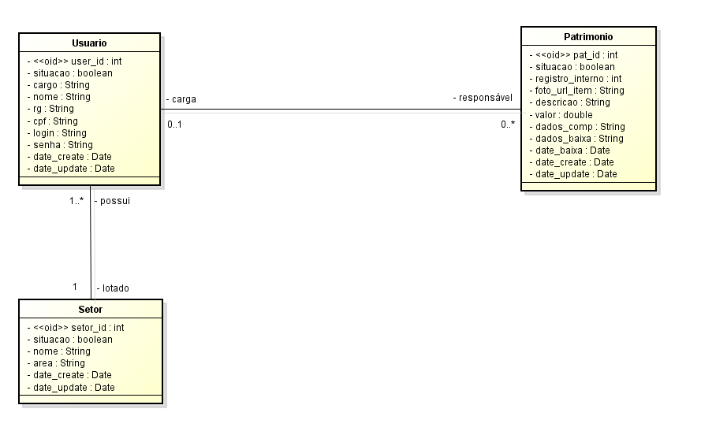
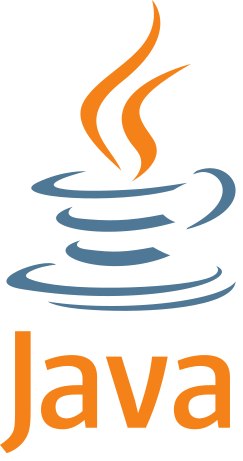
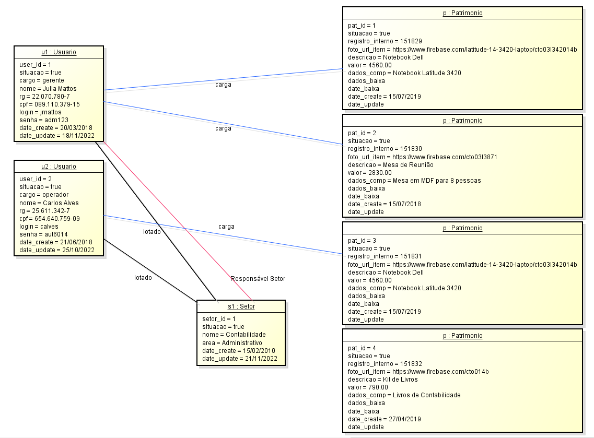

# Projeto Full Stack Patrimônio
Um projeto amostra para apresentar tecnologias e modelagem de dados

## Back-End:

## Front-End:

### Modelo Concentual

### Diagrama de Objetos

## Tecnologias e conceitos utilizados neste protótipo:
* Java 17
* Programação Orientada a Objetos
* UML - Unified Modeling Language
* Spring Boot 3.0
* Padrão RESTFul
* JPA - Hibernate
* MySQL
* React
* HTML 5
* CSS 3
