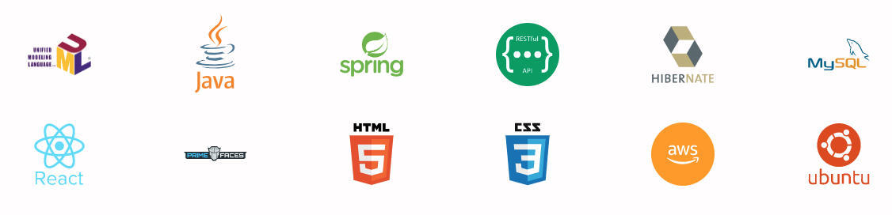
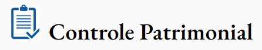

# Projeto Full Stack Patrimônio
Um projeto amostra para apresentar tecnologias e modelagem de dados

### Front-End - Consumo da API com base no React
* 

### Back-End - API Restful com base no Spring Boot 3.0
* 

### A regra de negócio
A necessidade de controle patrimonial de uma empresa, ou entidade privada, se faz necessário como um módulo administrativo que interage seus dados com outros módulos, como o controle de funcionários e a contabilidade. 
A entrada de um bem é feita por um código único que elencará os dados do item como sua carga patrimonial e a quem pertence este item.
Futuros relatórios ou balanços podem ser gerados com estes dados salvos em uma base de dados

### Modelo Concentual

### Diagrama de Objetos

## Tecnologias e conceitos utilizados neste protótipo:
* Java 17
* Programação Orientada a Objetos
* UML - Unified Modeling Language
* Spring Boot 3.0
* Padrão RESTFul
* JPA - Hibernate
* MySQL
* React
* HTML 5
* CSS 3
