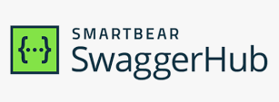

# Projeto Full Stack Patrimônio
Um projeto amostra para apresentar tecnologias e modelagem de dados

### Consumo da API com Front-End com base no React

### API com Back-End com base no Spring Boot 3.0

### Modelo Concentual

### Diagrama de Objetos

## Tecnologias e conceitos utilizados neste protótipo:
* Java 17
* Programação Orientada a Objetos
* UML - Unified Modeling Language
* Spring Boot 3.0
* Padrão RESTFul
* JPA - Hibernate
* MySQL
* React
* HTML 5
* CSS 3
